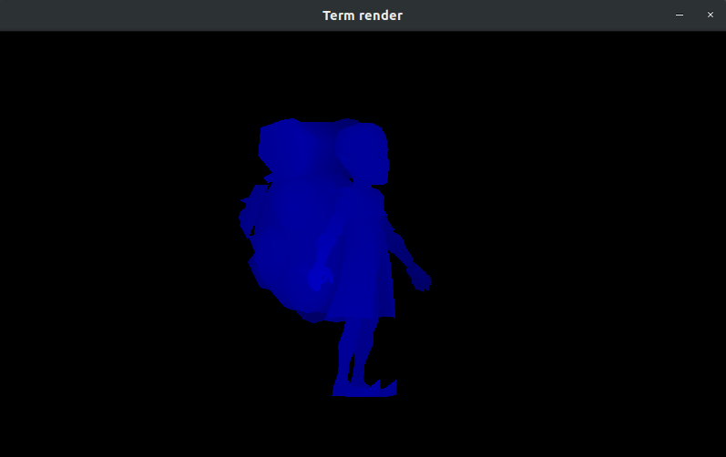

# Termrender
This repository has a 3d software render, creating purely in Go lang

For see execute code `go run ./cmd/main.go model-example.obj` in root project.

## Dependencies

- `github.com/faiface/pixel`