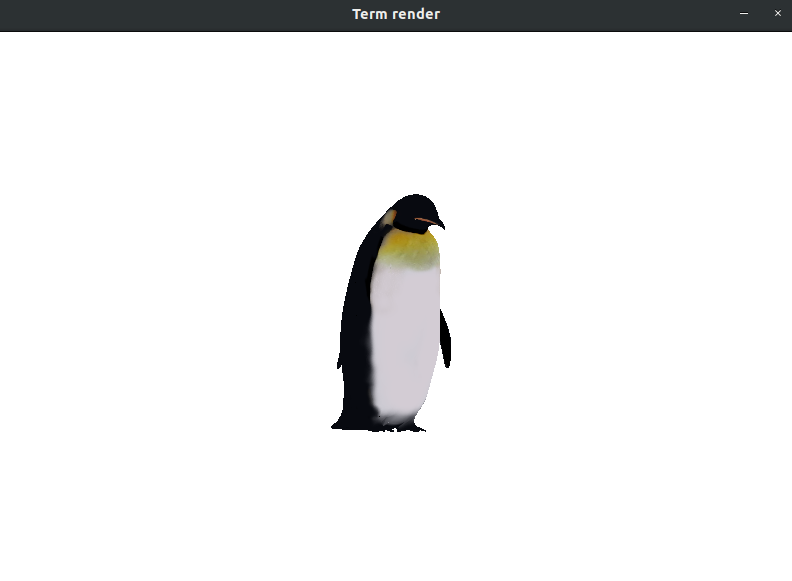

# Termrender
This repository has a 3d software render, creating purely in Go lang

## Install

- On Ubuntu/Debian-like Linux distributions, you need libgl1-mesa-dev and xorg-dev packages.
- On CentOS/Fedora-like Linux distributions, you need libX11-devel libXcursor-devel libXrandr-devel libXinerama-devel mesa-libGL-devel libXi-devel libXxf86vm-devel packages.

## Running

For see execute code `go run ./cmd/main.go model.obj texture.png` in root project.

## Dependencies

- `github.com/faiface/pixel`